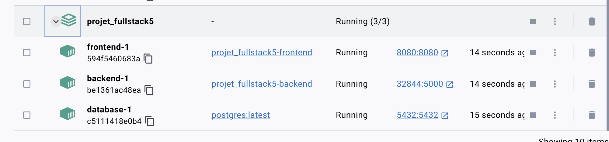
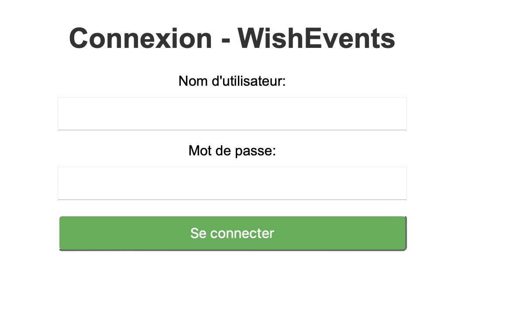
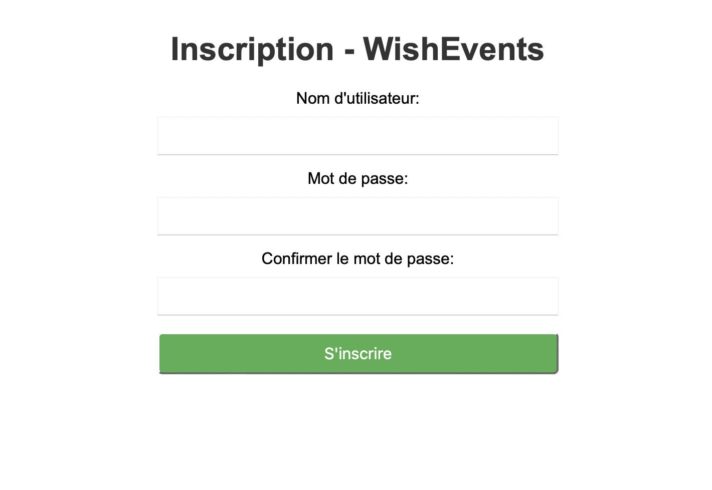

# projet_fullstack

## Introduction

Dans le cadre de l'unité DSIA-5102A : Application full stack data, un projet est à réaliser en groupe de binôme afin de mettre en oeuvre une application. Ce projet consiste à déployer une application complète avec une architecture client-serveur, où chaque composant est isolé dans un conteneur Docker: database, frontend et backend. 

Membre du groupe : Evelyne Su et Christine Wang.

Pour ce projet, nous avons décidé d'utiliser les données sur les évenements à Paris de [Opendata](https://opendata.paris.fr/explore/dataset/que-faire-a-paris-/export/?disjunctive.tags&disjunctive.address_name&disjunctive.address_zipcode&disjunctive.address_city&disjunctive.pmr&disjunctive.blind&disjunctive.deaf&disjunctive.transport&disjunctive.price_type&disjunctive.access_type&disjunctive.programs&basemap=jawg.dark&location=4,28.07198,-2.90039) pour créer une application qui s'appelle WishEvents, qui permet aux utilisateurs de consulter les évenements qui vont se dérouler à Paris ainsi que de les ajouter dans une liste tous les evenements qui les intéressent.

## Comment lancer le projet ?
Voici les étapes à suivre:

-Clonez le lien de notre git avec la commande suivante : 

 ```
> git clone https://github.com/wangchrist/projet_fullstack_final.git

```
-Lancez docker puis allez dans le repertoire projet_fullstack_final pour lancer le fichier docker-compose.yml ( pour créer les containers et de les activer )avec la commande suivante:

 ```
> docker compose build
> docker compose up

```
-Pour lancer la page web, vous devez cliquer sur le port du container backend 32844:5000

**Aperçu du docker**



**Aperçu de la page d'accueil**


**Aperçu de la page de connexion**



**Aperçu de la page d'inscription**



## Developer's guide

Eléments présents dans le dépots git :

- Un dossier backend : app.py (logique côté server) clean.py ( nettoyage des données du fichier evenement.csv puis va générer un nouveau fichier csv evenement_clean.csv), insert.py (créer les tables nécessaires ainsi que d'insérer les données du fichier evenement_clean.csv), un Dockerfile qui contient les instructions nécessaires à la création de l' image de conteneur backend et un fichier requirements.txt oû y a tous les librairies necessaires.

-Un dossier frontend: un dossier templates où y a tous les fichiers html necessaire pour l'affichage des requêtes, un Dockerfile et un requirements.txt ( librairies necessaires)

- Un fichier docker-compose.yml: pour créer les containers et de les activer


